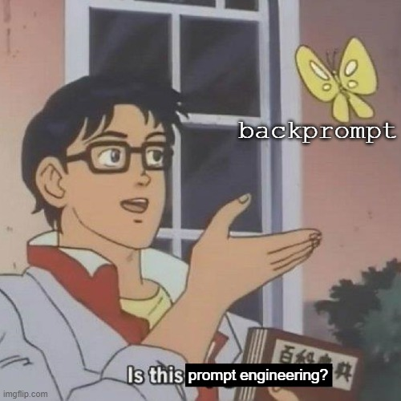

# backprompt

Toy project which will provide a data structure which allows a user to dynamically
construct prompts while avoiding repeated computations.

It would be cool if this idea could be used to create a prompt representation database.
A key is the (text, model and weights ID, tokenizer ID, children) and the value is the
model's representation of the text conditional on its children.

## Usage

TODO: visualization

## Setup

TODO

## Todos

Research

- [ ] Demonstrate time-savings, compute memory costs
- [ ] What's the computational complexity of using past keys and values wrt # tokens?
- [ ] What's it gonna take to create a DB?

Code

- [ ] Test
- [ ] Graph visualization
- [ ] Flesh out README
- [ ] Batching
- [ ] Eager mode
- [ ] `ModelRepr` dataclass for convenience
    - [ ] Add and update a `token_logprobs` attribute to the LM output obj
    - [ ] By default, only keep last (non-pad) token's logits in the LM output obj
- [ ] Documentation
- [ ] Allow for frozen representations?

